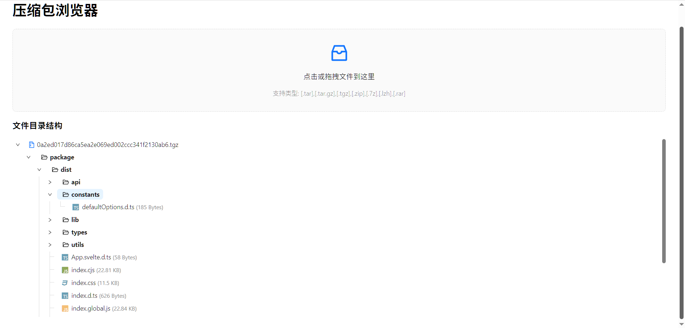

# Compressed Package Viewer (压缩包在线预览工具)

[English](#english) | [中文](#chinese)

`<a name="english"></a>`

## 🌟 Introduction

A web-based compressed package viewer built with React that allows users to preview and manage various compressed file formats directly in the browser. It provides an intuitive interface for browsing file contents, previewing text files, and downloading individual files from compressed packages.



### ✨ Key Features

- 🗂️ Support for multiple compression formats (.tar, .tar.gz, .tgz, .zip, .7z, .lzh, .rar)
- 📁 Tree-style directory structure visualization
- 📝 Text file preview capability
- ⬇️ Individual file download functionality
- 🎯 Drag and drop file upload
- 🎨 Beautiful file icons for different file types

## 🚀 Getting Started

### Prerequisites

- Node.js (version 16 or above)
- npm or yarn

### Installation

```bash
# Clone the repository
git clone https://github.com/tinaxinoo/CompressedPackViewer.git

# Enter the project directory
cd CompressedPackViewer

# Install dependencies
npm install

# Start the development server
npm run dev
```

## 🛠️ Tech Stack

- **React** - UI framework
- **Vite** - Build tool and development environment
- **Ant Design** - UI component library
- **libarchive.js** - Archive file processing
- **@exuanbo/file-icons-js** - File icons

## 📦 Build

```bash
# Build for production
npm run build

# Preview production build
npm run preview
```

---

`<a name="chinese"></a>`

## 🌟 项目介绍

这是一个基于React开发的压缩包在线预览工具，允许用户直接在浏览器中预览和管理各种格式的压缩文件。它提供了直观的界面来浏览文件内容、预览文本文件，并支持从压缩包中下载单个文件。

### ✨ 主要特性

- 🗂️ 支持多种压缩格式（.tar、.tar.gz、.tgz、.zip、.7z、.lzh、.rar）
- 📁 树形目录结构可视化
- 📝 文本文件预览功能
- ⬇️ 单文件下载功能
- 🎯 拖拽文件上传
- 🎨 针对不同文件类型显示美观的文件图标

## 🚀 快速开始

### 环境要求

- Node.js（16版本或以上）
- npm 或 yarn

### 安装步骤

```bash
# 克隆仓库
git clone https://github.com/tinaxinoo/CompressedPackViewer.git

# 进入项目目录
cd CompressedPackViewer

# 安装依赖
npm install

# 启动开发服务器
npm run dev
```

## 🛠️ 技术栈

- **React** - 用户界面框架
- **Vite** - 构建工具和开发环境
- **Ant Design** - UI组件库
- **libarchive.js** - 压缩文件处理
- **@exuanbo/file-icons-js** - 文件图标

## 📦 构建

```bash
# 构建生产版本
npm run build

# 预览生产构建
npm run preview
```
